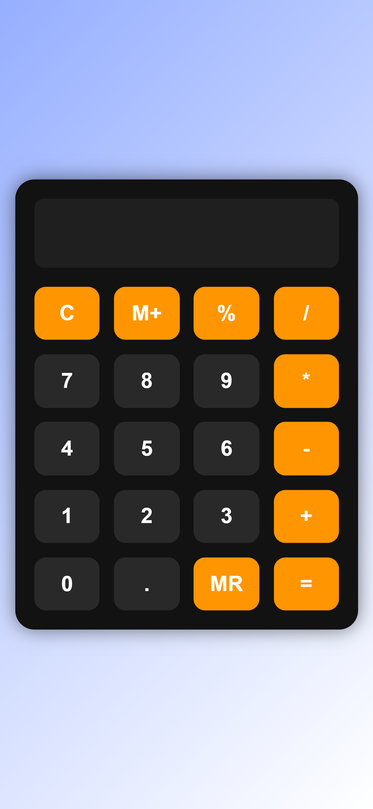

```markdown
# 🧮 Calculator Web App  

A sleek, responsive calculator with **memory functions (M+, MR)** and **keyboard support**, built with HTML, CSS, and JavaScript.  



[](https://atsuchak.github.io/SimpleCalculator/)  
[](LICENSE)  

---

## ✨ Features  
- **Basic Operations**: `+`, `-`, `*`, `/`, `%`  
- **Memory Functions**: Store values (`M+`) and recall (`MR`)  
- **Keyboard Support**: Type directly or use `Enter`/`Backspace`  
- **Responsive Design**: Works on mobile and desktop  
- **Modern UI**: Dark theme with smooth animations  

---

## 🚀 Quick Start  
1. **Clone the repo**:  
   ```bash
   git clone https://github.com/atsuchak/SimpleCalculator.git
   ```
2. **Open `index.html`** in your browser.  

No dependencies needed!  

---

## ⌨️ Usage  
- **Click buttons** or **use keyboard**:  
  - `C`: Clear  
  - `M`: Memory Store (`M+`)  
  - `R`: Memory Recall (`MR`)  
  - `Enter`: Calculate (`=`)  

---

## 🛠️ Tech Stack  
- **Frontend**: HTML5, CSS3, JavaScript  
- **Styling**: CSS Grid, Flexbox, gradients  
- **Tools**: Vanilla JS (no frameworks)  

---

## 📸 Screenshot  
  

---

## 🤝 Contributing  
Found a bug? Want a new feature?  
1. Fork the repo.  
2. Create a branch (`git checkout -b feature/your-feature`).  
3. Commit changes (`git commit -m 'Add feature'`).  
4. Push to the branch (`git push origin feature/your-feature`).  
5. Open a **Pull Request**.  

---

## 📜 License  
MIT © [Your Name](https://github.com/atsuchak)  

---

## 🙌 Credits  
- **Icons**: [Shields.io](https://shields.io)  
- **Font**: Segoe UI (system default)  
```
